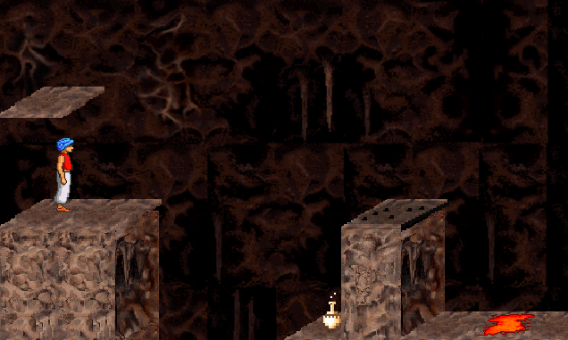

# Prince-Monogame
Monogame implementation of Prince of Persia 2 written in C#, code original idea by Andrea Falappi alias Polipo.

# Prerequisites

    -Windows
    MonoGame: 3.4 or higher
    OpenAL 2.0
    
    -Linux
    OpenGL 3.0
    SDL2 

# Build

Use Visual Studio 2017 or higher. Mono for Linux. Run PrinceGame.csproj to build

# Screenshots

# License
This Source Code Form is subject to the terms of the GNU GPL v 2.0. If a copy of the GPL was not distributed with this file, You can obtain one at http://www.gnu.org/licenses/old-licenses/gpl-2.0.html/.

